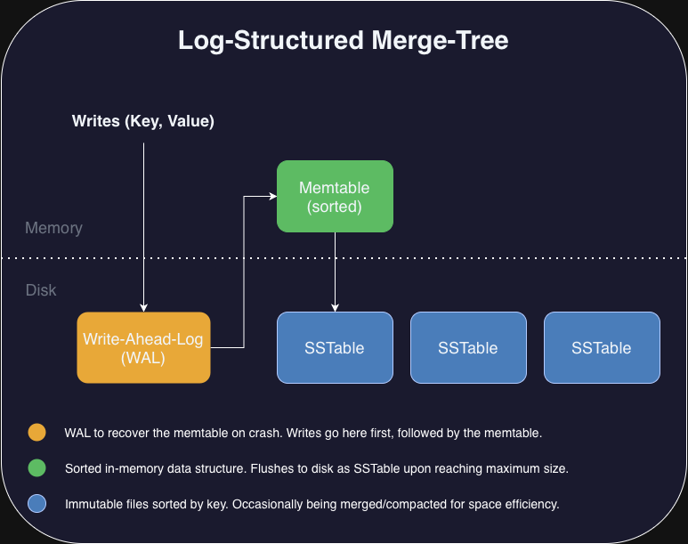

# LSM-Tree Storage Engine

C++23 implementation of a Log-Structured Merge-tree, the data structure behind RocksDB, LevelDB, and Cassandra.



## Features

- **MemTable**: In-memory `std::map` (implemented as a red-black tree), flushes to disk when "full"
- **SSTable**: Immutable sorted files, mmap'd for reads
- **WAL**: Write-ahead log with `fsync()` durability
- **Compaction**: Merge-sort based, triggers at 4 SSTables
- **Recovery**: Rebuilds state from WAL on startup

## Error handling with `std::expected`

No exceptions in the storage path. Operations return `std::expected<T, StorageError>`:

```cpp
auto result = sstable.read_entry();
if (!result) {
    // handle StorageError
}
// use *result
```

This chains nicely with `.and_then()` and `.transform()` for functional composition. The tradeoff is explicit error handling everywhere, but you get predictable performance and the compiler catches unhandled errors.

## Build

```bash
cmake -B build && cmake --build build
./build/test/lsm_test    # tests
./build/lsm              # 10K puts/gets benchmark
```

Debug build enables ASan + UBSan:
```bash
cmake -B build -DCMAKE_BUILD_TYPE=Debug
```

## Performance notes

- mmap for SSTable reads eliminates syscall overhead (read() was initially 99% of time in profiles)
- Switched from zlib CRC32 to xxHash (CRC32 was 70% of CPU time in profiles)
- Buffered writes batch data before hitting disk

## TODOs
- [ ] Block-based SSTable format
- [ ] Bloom filters
- [ ] Leveled compaction
- [ ] Range scans

## References

- CMU 15-445
- Designing Data-Intensive Applications (Kleppmann)
- LevelDB source
