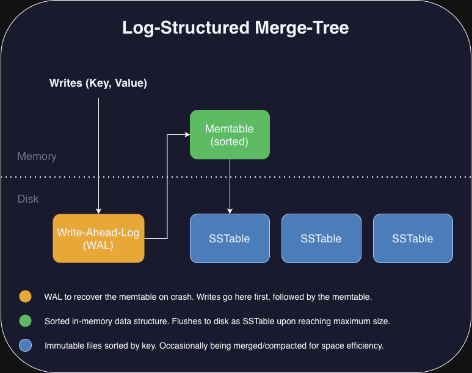

# LSM-Tree Storage Engine

C++23 implementation of a Log-Structured Merge-tree.



## Features

- **MemTable**: In-memory `std::map` (implemented as a red-black tree), flushes to disk when "full"
- **SSTable**: Immutable sorted files, mmap'd for reads
- **WAL**: Write-ahead log with `fsync()` durability
- **Compaction**: Merge-sort based, triggers at 4 SSTables
- **Recovery**: Rebuilds state from WAL on startup

## Build

```bash
cmake -B build && cmake --build build
./build/test/lsm_test    # tests
./build/lsmtree             # 10K puts/gets benchmark
```

Debug build enables ASan + UBSan:
```bash
cmake -B build -DCMAKE_BUILD_TYPE=Debug
```

## TODOs
- [ ] Block-based SSTable format
- [x] Bloom filters
- [ ] Leveled compaction
- [ ] Range scans

## References

- CMU 15-445
- Designing Data-Intensive Applications (Kleppmann)
- LevelDB source
